# CaseLaw AI: Advanced Legal Research Platform

[](https://reactjs.org/)
[](https://fastapi.tiangolo.com/)
[](https://www.typescriptlang.org/)
[](https://www.python.org/)
[](https://opensource.org/licenses/MIT)

## 🚨 MASSIVE DATASET WARNING 🚨

**This is NOT a typical web application. The data requirements are ENORMOUS:**

| Component | Size | Description |
|-----------|------|-------------|
| **Raw Dataset** | **81GB** | 1,000 parquet files from Hugging Face |
| **Vector Storage** | **~50GB** | Qdrant database with 30M+ embeddings |
| **SQLite Index** | **6.3GB** | Metadata and case classification database |
| **Total Disk Space** | **~150GB** | Minimum required for full dataset |
| **RAM Required** | **64-128GB** | 64GB minimum, 128GB+ recommended |
| **Processing Time** | **48-72 hours** | On modern multi-core hardware |

**DO NOT attempt to run this project without proper infrastructure!**

## Overview

CaseLaw AI is a sophisticated legal research platform that combines semantic search, vector databases, and AI-powered analysis to help legal professionals navigate through millions of court cases efficiently. Built with a modern tech stack including React, TypeScript, and Python, it provides an intuitive interface for searching, analyzing, and managing legal documents.

## Features

- **Semantic Search**: AI-powered search using OpenAI embeddings for contextual understanding
- **Advanced Filtering**: Filter by jurisdiction, court level, date ranges, and case types
- **Real-time Results**: Fast search results with relevance scoring
- **Case Management**: Save cases, add notes, and track research history
- **Dark Mode**: Full theme support for comfortable reading
- **Responsive Design**: Works seamlessly on desktop and mobile devices
- **PDF Export**: Generate formatted PDFs of case documents
- **Research Notes**: Create and manage notes linked to specific cases

### Screenshots

#### Home Page

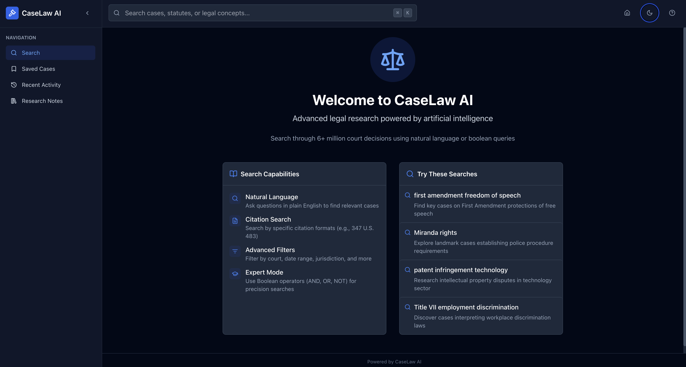

#### Search Interface
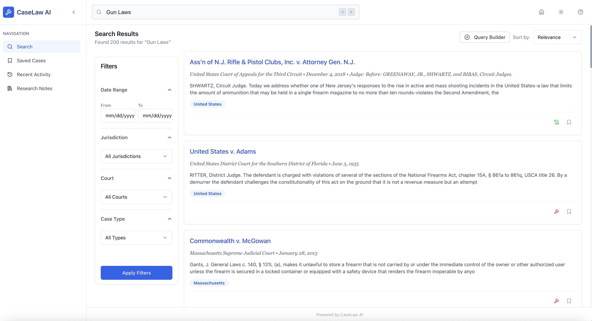
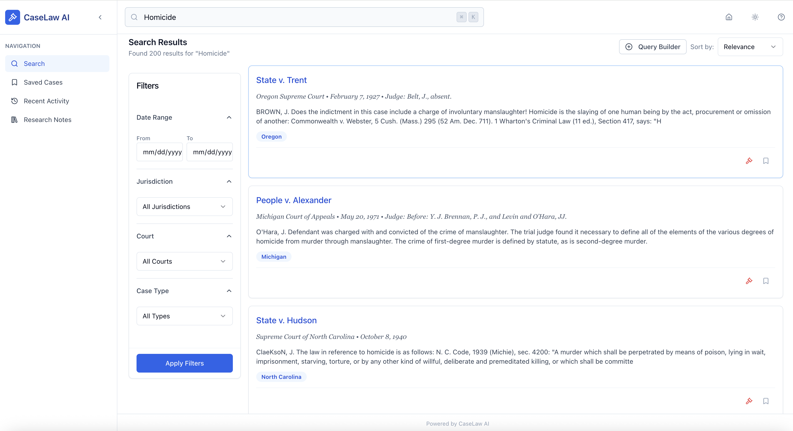

#### Case Details
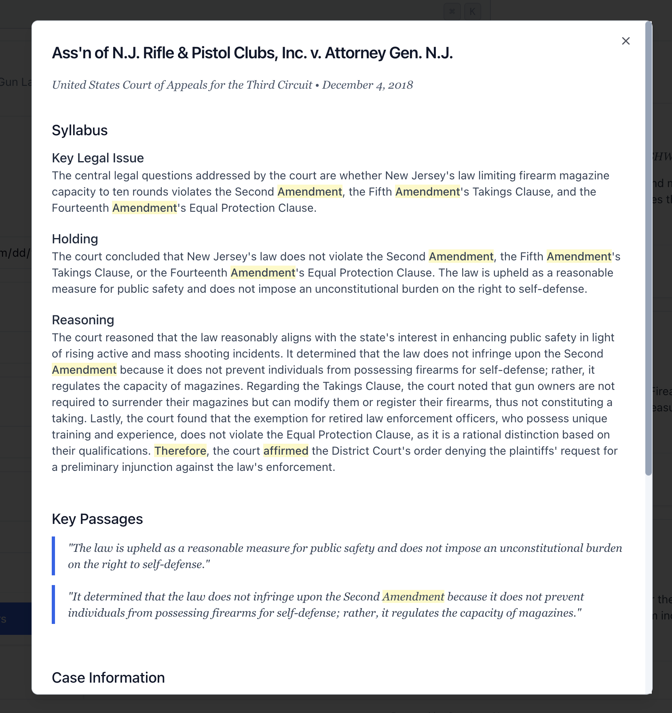
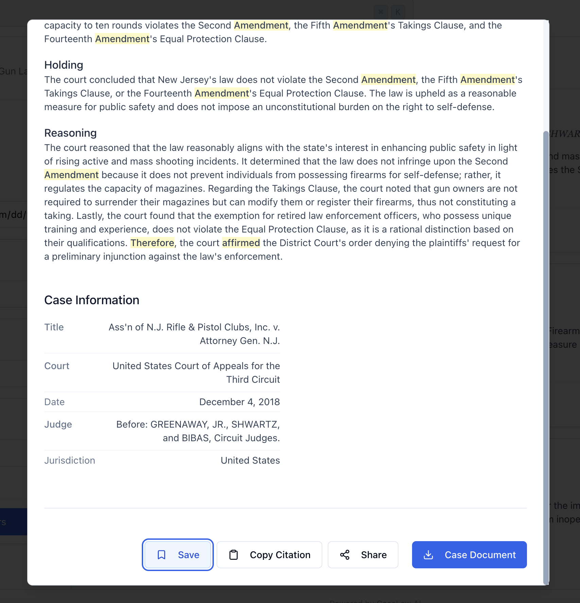
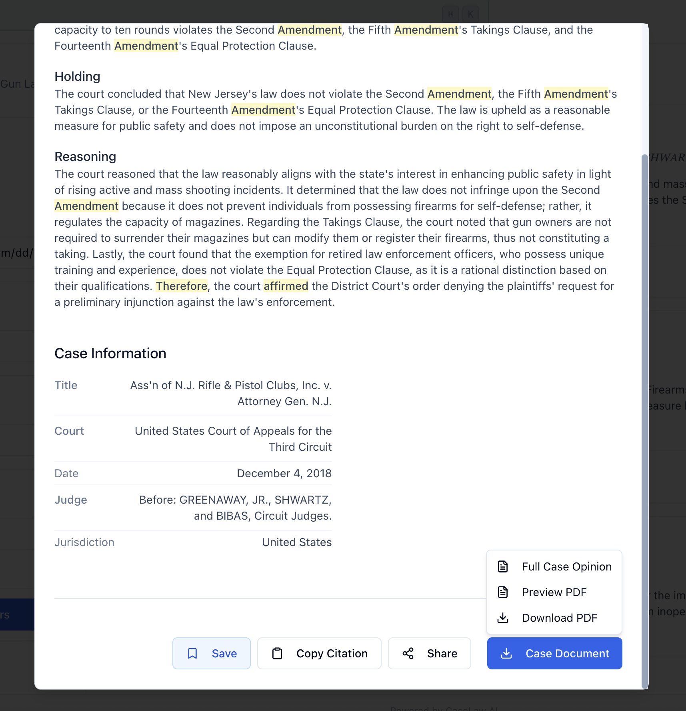

#### Filtering Options
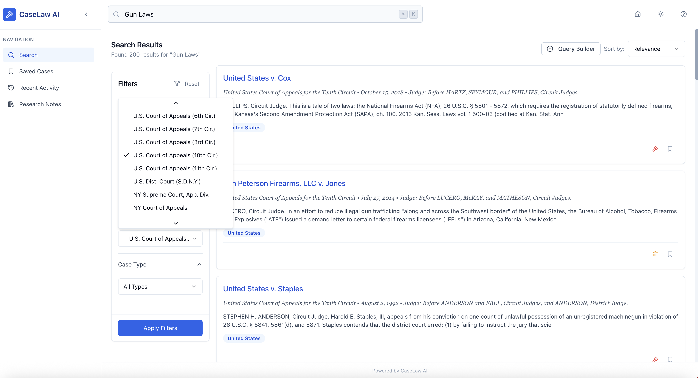
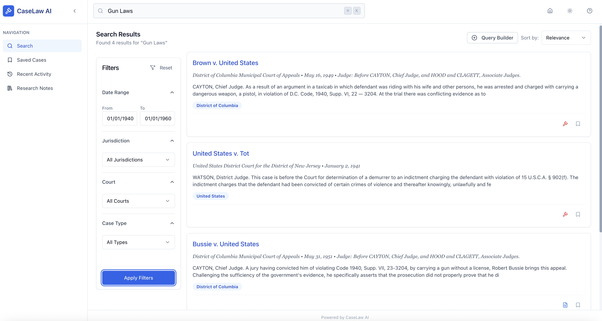
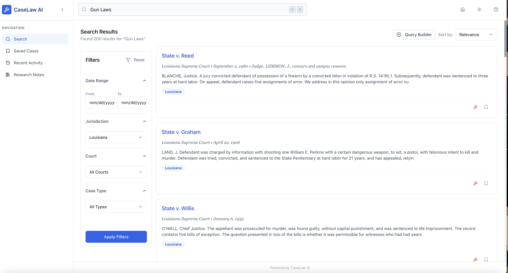
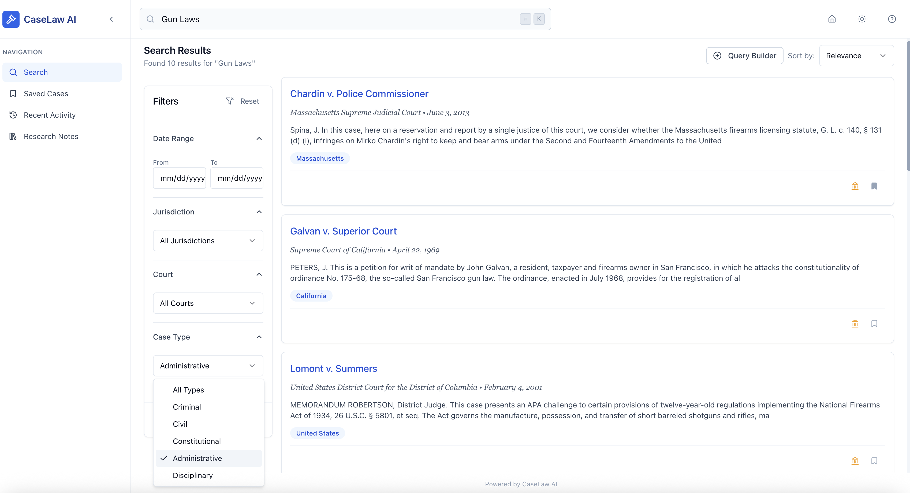

#### User Features
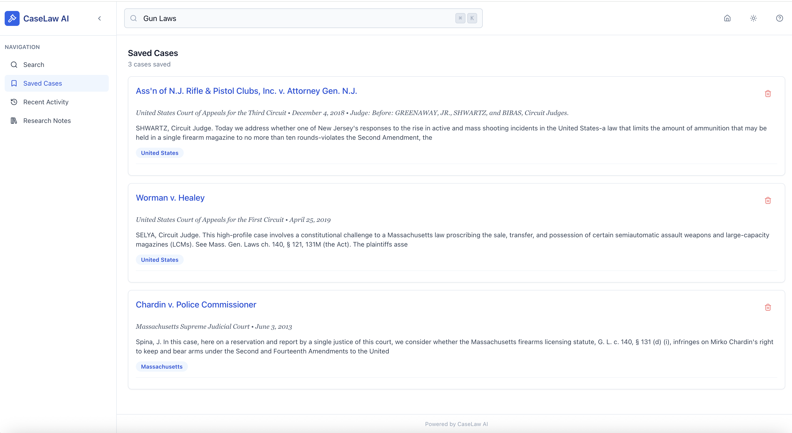
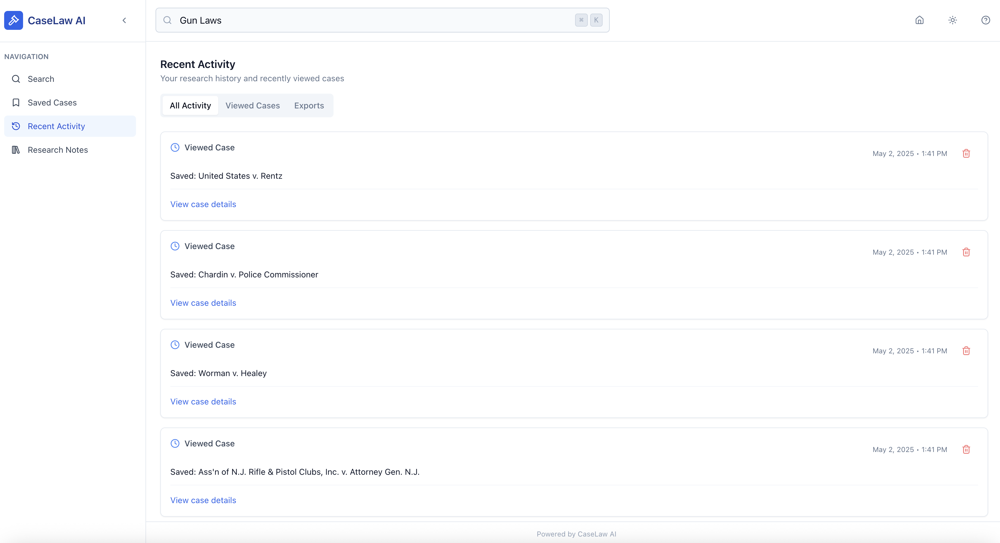

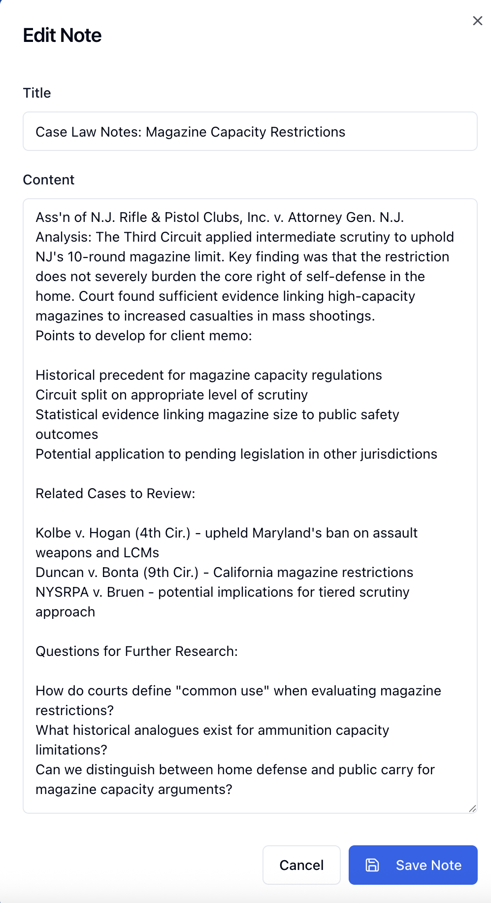

#### Help System
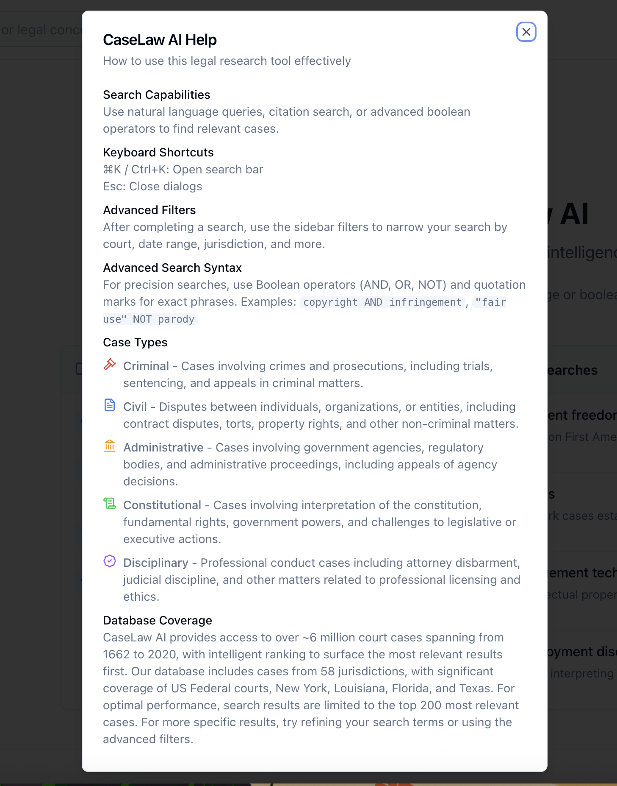

## Dataset

CaseLaw AI utilizes the comprehensive Caselaw Access Project dataset, containing:

- **6.8 million legal cases** spanning from 1662-2020
- **30+ million vector embeddings** for semantic search
- **58 jurisdictions** across the United States
- **3,064 unique courts**
- **6.3GB SQLite index** for efficient metadata retrieval
- **45GB+ Qdrant vector database** for similarity search

Each case includes:
- Full text of the court decision
- Metadata (court, date, jurisdiction, citations)
- Case type classification (Criminal, Civil, Administrative, Constitutional, Disciplinary)

## Tech Stack

### Frontend
- **React 18** with TypeScript
- **Vite** for fast development and building
- **TanStack Query** for data fetching and caching
- **Tailwind CSS** with shadcn/ui components
- **React Router** for navigation
- **Lucide Icons** for consistent iconography

### Backend
- **FastAPI** for high-performance Python API
- **Qdrant** vector database for semantic search
- **SQLite** for metadata and full-text search
- **OpenAI** for embeddings generation
- **PyPDF2** for PDF processing
- **Pydantic** for data validation

## Data Pipeline Architecture

```
┌─────────────────────────────────────────────────────────────────────┐
│                        DATA INGESTION PIPELINE                      │
├─────────────────────────────────────────────────────────────────────┤
│                                                                     │
│  1. RAW DATA SOURCES                                                │
│     ├── Court Archives (PDF/XML/JSON)                               │
│     ├── Legal Databases (Hugging Face Dataset)                      │
│     └── Historical Records                                          │
│                    │                                                │
│                    ▼                                                │
│  2. DATA EXTRACTION                                                 │
│     ├── Parquet File Processing                                    │
│     ├── OCR for Scanned Documents                                  │
│     └── Metadata Extraction                                        │
│                    │                                                │
│                    ▼                                                │
│  3. DATA PROCESSING                                                 │
│     ├── Text Cleaning & Normalization                              │
│     ├── Citation Extraction                                        │
│     ├── Key Passage Identification                                 │
│     └── Case Type Classification                                   │
│                    │                                                │
│                    ▼                                                │
│  4. EMBEDDING GENERATION                                            │
│     ├── OpenAI text-embedding-3-small                              │
│     ├── Chunking Strategy (2000 tokens)                            │
│     └── Parallel Batch Processing                                  │
│                    │                                                │
│                    ▼                                                │
│  5. STORAGE LAYER                                                   │
│     ├── Qdrant: Vector embeddings (1536 dimensions)                │
│     ├── SQLite: Metadata & full-text search                        │
│     └── Parquet: Processed case data                               │
│                                                                     │
└─────────────────────────────────────────────────────────────────────┘
```

## System Architecture

```
┌─────────────────────────────────────────────────────────────────────┐
│                          SYSTEM ARCHITECTURE                        │
├─────────────────────────────────────────────────────────────────────┤
│                                                                     │
│  CLIENT LAYER                                                       │
│  ┌─────────────────────────────────────────────────────────┐       │
│  │  React SPA (Vite + TypeScript)                          │       │
│  │  ├── Search Interface                                   │       │
│  │  ├── Case Viewer                                        │       │
│  │  ├── Filters & Facets                                   │       │
│  │  └── User Dashboard                                     │       │
│  └─────────────────────────────────────────────────────────┘       │
│                         │                                           │
│                         │ HTTP/REST                                 │
│                         ▼                                           │
│  API LAYER                                                          │
│  ┌─────────────────────────────────────────────────────────┐       │
│  │  FastAPI Backend                                        │       │
│  │  ├── /api/v1/search - Semantic search endpoint         │       │
│  │  ├── /api/v1/cases - Case retrieval                    │       │
│  │  ├── /api/v1/filters - Dynamic filter options          │       │
│  │  └── /api/v1/export - PDF generation                   │       │
│  └─────────────────────────────────────────────────────────┘       │
│                         │                                           │
│                         ▼                                           │
│  SERVICE LAYER                                                      │
│  ┌─────────────────────────────────────────────────────────┐       │
│  │  ├── Search Service (Hybrid search logic)               │       │
│  │  ├── OpenAI Service (Embeddings)                        │       │
│  │  ├── Qdrant Service (Vector search)                     │       │
│  │  └── SQLite Service (Metadata & FTS)                    │       │
│  └─────────────────────────────────────────────────────────┘       │
│                         │                                           │
│                         ▼                                           │
│  DATA LAYER                                                         │
│  ┌─────────────────────────────────────────────────────────┐       │
│  │  ├── Qdrant DB (30M+ vectors, 45GB+)                    │       │
│  │  ├── SQLite DB (Metadata, 10GB+)                        │       │
│  │  └── Parquet Files (Processed data)                     │       │
│  └─────────────────────────────────────────────────────────┘       │
│                                                                     │
└─────────────────────────────────────────────────────────────────────┘
```

## Case Types Supported

1. **Criminal**: Cases involving violations of criminal law and prosecution by the state
2. **Civil**: Disputes between private parties including torts, contracts, and property disputes
3. **Administrative**: Cases involving government agencies and regulatory matters
4. **Constitutional**: Cases interpreting constitutional provisions and rights
5. **Disciplinary**: Cases involving professional misconduct and disciplinary proceedings

## Prerequisites

- **Node.js** 18.x or higher
- **Python** 3.9 or higher
- **Docker** and Docker Compose
- **Minimum 64GB RAM** (recommended 128GB for production)
- **500GB+ SSD storage** for databases
- **NVIDIA GPU** (optional, for faster embeddings)

## Installation

### 1. Clone the Repository

```bash
git clone https://github.com/yourusername/caselaw-search-ui.git
cd caselaw-search-ui
```

### 2. Set up the Qdrant Vector Database

```yaml
# docker-compose.yml
version: '3.8'
services:
  qdrant:
    image: qdrant/qdrant:latest
    ports:
      - "6333:6333"
      - "6334:6334"
    volumes:
      - ./qdrant_storage:/qdrant/storage
    environment:
      - QDRANT_ALLOW_CREATION_ON_FILE_ABSENCE=true
```

Run with:
```bash
docker-compose up -d
```

### 3. Backend Setup

```bash
cd backend
python -m venv venv
source venv/bin/activate  # On Windows: venv\Scripts\activate
pip install -r requirements.txt
```

### 4. Frontend Setup

```bash
cd frontend
npm install
```

### 5. Environment Configuration

Create `.env` files in both frontend and backend directories:

**Backend `.env`:**
```env
OPENAI_API_KEY=your_openai_api_key
QDRANT_HOST=localhost
QDRANT_PORT=6333
SQLITE_DB_PATH=./data/caselaw.db
```

**Frontend `.env`:**
```env
VITE_API_URL=http://localhost:8000
```

## Data Ingestion

### Processing Pipeline

The data ingestion pipeline handles millions of legal documents. **Warning**: This process takes 48-72 hours and requires ~150GB of disk space!

```bash
# 1. Download and process the dataset
cd backend
python parallel_processor.py

# 2. Create the SQLite index
python create_sqlite_index.py \
  --parquet-dir ./caselaw_processing/downloads/[...]/TeraflopAI___Caselaw_Access_Project_clusters \
  --db ./case_lookup.db

# 3. Upload vectors to Qdrant
python upload_vectors.py --collection caselaw_v3

# 4. Optimize Qdrant collection
python optimize_qdrant.py
```

### Key Processing Scripts

#### `parallel_processor.py`
Downloads and processes the entire dataset from Hugging Face:
- Downloads 1,000 parquet files in parallel
- Generates embeddings using OpenAI's text-embedding-3-small
- Handles token limits and memory optimization
- Saves embeddings as pickle files for later upload
- **Runtime**: 48-72 hours on high-end hardware

#### `create_sqlite_index.py`
Creates the SQLite metadata database:
- Processes all parquet files to extract metadata
- Classifies cases into types (Criminal, Civil, etc.)
- Creates optimized indexes for fast filtering
- **Output**: 6.3GB SQLite database

#### `upload_vectors.py`
Uploads processed embeddings to Qdrant:
- Reads pickle files from `parallel_processor.py`
- Uploads in batches to avoid overwhelming Qdrant
- Handles retry logic and error recovery
- **Runtime**: 2-4 hours depending on hardware

### Data Volume Considerations

- **Raw Data**: ~500GB of court documents (81GB compressed)
- **Processed Data**: ~100GB of parquet files
- **Vector Database**: ~45GB in Qdrant
- **SQLite Database**: ~10GB of metadata
- **Processing Time**: 48-72 hours on modern hardware

## Usage

### Starting the Application

1. **Start the backend:**
```bash
cd backend
uvicorn app.main:app --reload --host 0.0.0.0 --port 8000
```

2. **Start the frontend:**
```bash
cd frontend
npm run dev
```

3. Access the application at `http://localhost:5173`

### API Endpoints

- `POST /api/v1/search` - Semantic search with filters
- `GET /api/v1/cases/{case_id}` - Retrieve specific case
- `GET /api/v1/filters` - Get available filter options
- `POST /api/v1/export/pdf` - Generate PDF export

### Search Query Examples

```json
{
  "query": "fourth amendment vehicle search",
  "filters": {
    "jurisdiction": ["federal"],
    "date_from": "2015-01-01",
    "date_to": "2023-12-31",
    "court_level": ["supreme", "appellate"]
  },
  "limit": 20,
  "offset": 0
}
```

## Performance Optimization

### Vector Search Optimization

- **HNSW Index**: Configured with `m=16, ef_construction=100`
- **Quantization**: Scalar quantization reduces memory by 75%
- **Batch Processing**: Process queries in batches of 100
- **Caching**: Redis cache for frequent queries

### Database Optimization

- **SQLite**: Full-text search indexes on case_name, summary
- **Partitioning**: Date-based partitioning for faster queries
- **Connection Pooling**: Max 50 concurrent connections

## Development

### Running Tests

```bash
# Backend tests
cd backend
pytest tests/ -v

# Frontend tests
cd frontend
npm run test
```

### Code Style

- **Backend**: Black formatter, flake8 linting
- **Frontend**: ESLint with Prettier

### Contributing

1. Fork the repository
2. Create a feature branch
3. Commit your changes
4. Push to the branch
5. Create a Pull Request

## Deployment

### Production Considerations

- Use dedicated Qdrant cluster or Qdrant Cloud
- PostgreSQL instead of SQLite for better concurrency
- Redis for caching layer
- CDN for static assets
- Load balancer for API servers

### Docker Deployment

```bash
docker-compose -f docker-compose.prod.yml up -d
```

## Troubleshooting

### Common Issues

1. **Out of Memory**: Increase Docker memory limits
2. **Slow Searches**: Check Qdrant index configuration
3. **Missing Cases**: Verify data pipeline completion
4. **API Timeouts**: Adjust FastAPI timeout settings

### Debug Mode

Enable debug logging:
```python
# backend/app/core/config.py
DEBUG = True
LOG_LEVEL = "DEBUG"
```

## Dataset Limitations

- **Time Range**: Cases from 1662-2020
- **Jurisdictions**: 58 jurisdictions (federal and state)
- **Completeness**: Some jurisdictions have more comprehensive coverage than others
- **Processing**: Some cases may have OCR artifacts or formatting inconsistencies

## Quick Start Options

### Option A: Use Pre-built Data (Recommended)

If you want to avoid the 48-72 hour processing time, contact the repository owner for:
- Pre-populated Qdrant backup (~50GB)
- SQLite database file (`case_lookup.db` - 6.3GB)
- Instructions for data restoration

### Option B: Build From Scratch

Follow the Data Ingestion section above. Ensure you have:
- 150GB+ free disk space
- 64GB+ RAM
- Stable internet connection
- 48-72 hours for processing

## License

This project is licensed under the MIT License - see the [LICENSE](LICENSE) file for details.

## Acknowledgments

- OpenAI for embeddings API
- Qdrant team for vector database
- shadcn/ui for component library
- Caselaw Access Project for the dataset
- All contributors and legal data providers

---

**⚠️ CRITICAL WARNING**: This application requires MASSIVE computational resources. The full dataset includes over 6.8 million legal cases, generating 30+ million vector embeddings. Ensure your infrastructure can handle:
- Minimum 64GB RAM (128GB recommended)
- 500GB+ fast SSD storage
- Modern multi-core CPU (16+ cores recommended)
- Stable internet for API calls
- Sufficient OpenAI API credits for embeddings

This is NOT a typical web application - it's a data-intensive platform designed for serious legal research. DO NOT attempt to run this without proper infrastructure!

## Disclaimer

This project is a technical demonstration of semantic search capabilities using publicly available legal data from the Caselaw Access Project. It was developed as part of a consulting project with the client's encouragement to make legal research tools more accessible. No proprietary client data or confidential information is included in this repository.