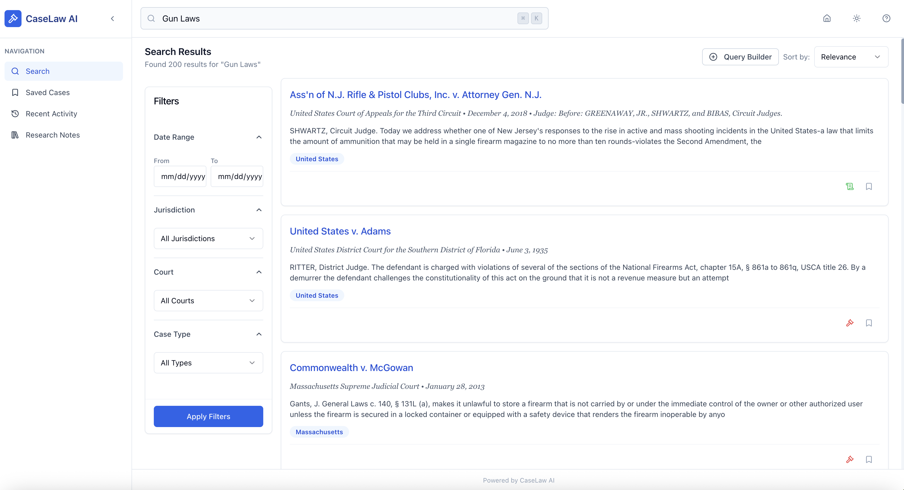
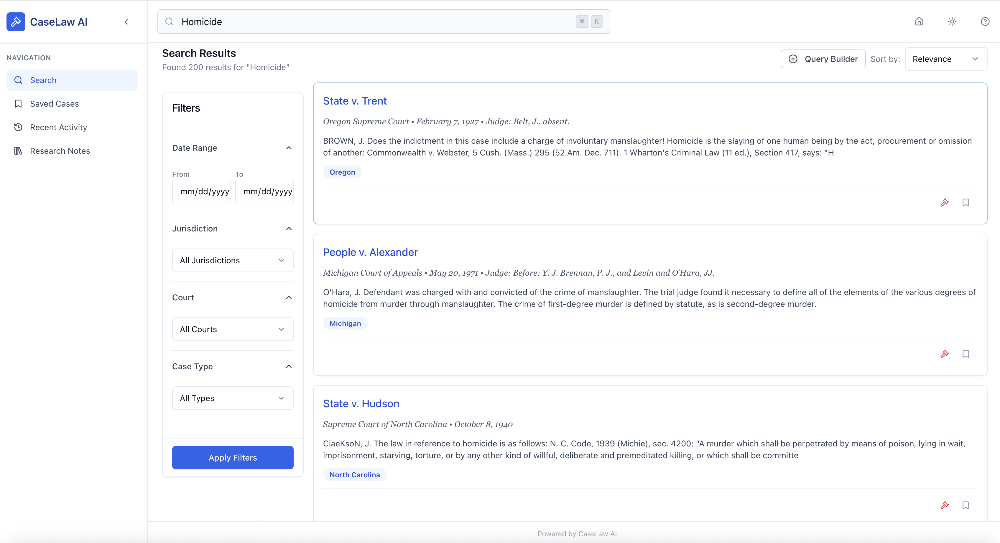
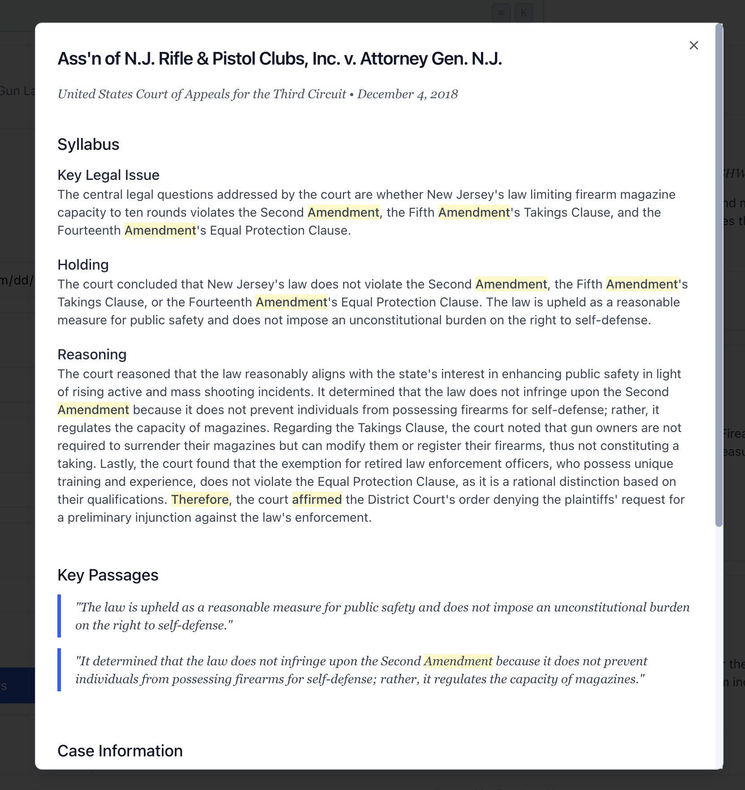

# CaseLaw AI Frontend

A modern, responsive web application for legal professionals to search, explore, and analyze millions of court cases using natural language. Built with React, TypeScript, and powered by advanced semantic search technology.

> **Note**: This is the frontend documentation. For backend setup and full project overview, see the [main project README](../README.md).

## 🚀 Quick Start

Get up and running in just 3 steps!

### Prerequisites Check
Before you begin, ensure you have:
- ✅ Node.js 18.x or higher (`node --version`)
- ✅ npm 8.x or higher (`npm --version`)
- ✅ Backend API running (see [main README](../README.md) for backend setup)

### 3-Step Setup

```bash
# 1. Clone the repository
git clone https://github.com/carlosrod723/Caselaw-Search-AI.git
cd Caselaw-Search-AI/frontend

# 2. Install dependencies
npm install

# 3. Start the development server
npm run dev
```

🎉 **That's it!** Visit [http://localhost:5173](http://localhost:5173) to see the app in action.

## ✨ Features

### 🔍 Intelligent Search
- **Semantic Search**: Use natural language queries like "fourth amendment vehicle search" instead of complex keyword combinations
- **Real-time Results**: Get instant search results as you type with debounced API calls
- **Smart Ranking**: Results ordered by relevance using advanced vector similarity

### 🎯 Advanced Filtering
- **Jurisdiction Filter**: Focus on federal, state, or specific jurisdictions
- **Court Selection**: Filter by Supreme Court, appellate courts, or district courts
- **Case Type Classification**: Criminal, Civil, Administrative, Constitutional, or Disciplinary
- **Date Range**: Search within specific time periods from 1662 to 2020

### 🎨 Beautiful UI/UX
- **Dark/Light Theme**: Toggle between themes for comfortable reading day or night
- **Responsive Design**: Works seamlessly on desktop, tablet, and mobile devices
- **Accessible Components**: Built with accessibility in mind using Radix UI primitives

### 📚 Research Tools
- **Save Cases**: Build your personal library of important cases
- **Research Notes**: Add annotations and notes to any case
- **Export to PDF**: Generate formatted PDFs of case documents
- **Search History**: Track and revisit your recent searches

## 📸 Screenshots

### Search Interface
Experience the power of semantic search with our intuitive interface:


*Natural language search with instant results*


*Filtered search results for specific case types*

### Case Details
Deep dive into any case with our comprehensive detail view:


*Full case information with key passages highlighted*

### Filtering Options
Narrow down results with powerful filters:


### Theme Variations
Choose your preferred viewing experience:


*Clean, professional light theme*


*Eye-friendly dark theme for extended research sessions*

## 🧩 UI Components

Our component library is built on top of [shadcn/ui](https://ui.shadcn.com/), providing beautiful, accessible components out of the box.

### Component Examples

#### Search Bar Component
```tsx
import { SearchBar } from '@/components/search/search-bar';

// Simple usage
<SearchBar 
  placeholder="Search 6.8 million cases..." 
  onSearch={(query) => handleSearch(query)} 
/>
```

#### Filter Component
```tsx
import { Filters } from '@/components/search/filters';

// Advanced filtering
<Filters
  jurisdictions={["federal", "new-york", "california"]}
  caseTypes={["criminal", "civil"]}
  dateRange={{ from: "2010-01-01", to: "2020-12-31" }}
  onFilterChange={(filters) => updateSearch(filters)}
/>
```

#### Case Card Component
```tsx
import { ResultCard } from '@/components/search/result-card';

// Display search results
<ResultCard
  case={{
    id: "123",
    name: "Miranda v. Arizona",
    court: "U.S. Supreme Court",
    date: "1966-06-13",
    summary: "Established Miranda rights...",
    relevanceScore: 0.95
  }}
  onClick={(caseId) => openCaseDetails(caseId)}
/>
```

### Available UI Components

- **Buttons**: Primary, secondary, ghost, and destructive variants
- **Cards**: For displaying case information and search results
- **Dialogs**: Modal windows for case details and confirmations
- **Forms**: Input fields, select dropdowns, and date pickers
- **Tables**: For structured data display
- **Toasts**: Non-intrusive notifications
- **Badges**: For case types and metadata
- **Skeleton**: Loading states for better UX

## 🛠 Technology Stack

### Core Framework
- **React 18**: Latest features including concurrent rendering
- **TypeScript**: Full type safety and better developer experience
- **Vite**: Lightning-fast development and optimized builds

### Styling & UI
- **Tailwind CSS**: Utility-first CSS for rapid development
- **shadcn/ui**: High-quality, customizable component library
- **Lucide Icons**: Beautiful, consistent icon set

### State & Data Management
- **TanStack Query**: Powerful data synchronization and caching
- **React Context**: Global state for user preferences and search context
- **LocalStorage**: Persistent storage for saved cases and preferences

### Development Tools
- **ESLint**: Code quality and consistency
- **Prettier**: Automatic code formatting
- **TypeScript**: Static type checking

## 📁 Project Structure

```
frontend/
├── client/               # Client application
│   ├── public/           # Static assets
│   │   └── favicon.ico   # App icon
│   └── src/              
│       ├── components/   # Reusable UI components
│       │   ├── case-detail/   # Case viewing components
│       │   ├── layouts/       # Page layouts
│       │   ├── search/        # Search functionality
│       │   ├── sidebar/       # Navigation sidebar
│       │   ├── ui/            # Base UI components
│       │   └── welcome/       # Welcome screen
│       ├── context/      # React context providers
│       ├── hooks/        # Custom React hooks
│       ├── lib/          # Utilities and helpers
│       ├── pages/        # Page components
│       └── types/        # TypeScript definitions
├── server/               # Development server config
└── shared/               # Shared utilities
```

## 🔧 Configuration

### Environment Variables

Create a `.env.local` file in the frontend directory:

```env
# API Configuration
VITE_API_BASE_URL=http://localhost:8000

# UI Settings
VITE_DEFAULT_RESULTS_PER_PAGE=20
VITE_ENABLE_ANIMATIONS=true

# Feature Flags
VITE_ENABLE_PDF_EXPORT=true
VITE_ENABLE_SAVED_SEARCHES=true

# Development
VITE_DEBUG_MODE=false
```

### Available Scripts

```bash
# Development
npm run dev          # Start dev server (http://localhost:5173)
npm run build        # Build for production
npm run preview      # Preview production build

# Code Quality
npm run lint         # Check code quality
npm run lint:fix     # Fix linting issues
npm run typecheck    # TypeScript validation

# Testing
npm test            # Run test suite
npm run test:watch  # Run tests in watch mode
```

## 🚀 Performance Features

The frontend is optimized for handling millions of search results:

1. **Virtual Scrolling**: Efficiently render large result lists
2. **Lazy Loading**: Components and routes load on demand
3. **Debounced Search**: Prevents excessive API calls
4. **Strategic Caching**: Smart caching with React Query
5. **Optimized Rendering**: Memoization for expensive operations
6. **Progressive Enhancement**: Works on slower connections

## 🌐 Browser Support

- Chrome/Edge (latest 2 versions)
- Firefox (latest 2 versions)
- Safari (latest 2 versions)
- Mobile Safari (iOS 14+)
- Chrome for Android (latest)

## 🤝 Contributing

We welcome contributions! Please:

1. Fork the repository
2. Create a feature branch (`git checkout -b feature/amazing-feature`)
3. Commit your changes (`git commit -m 'Add amazing feature'`)
4. Push to the branch (`git push origin feature/amazing-feature`)
5. Open a Pull Request

See the [main project README](../README.md) for detailed contribution guidelines.

## 📄 License

This project is licensed under the MIT License - see the [LICENSE](../LICENSE) file for details.

---

Built with ❤️ for the legal community. Happy searching! 🔍⚖️